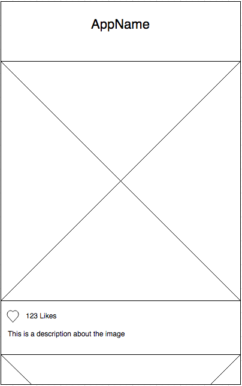

# Enkel galleri-app

En samlingsida för galleri sidor gjorda av deltagare från Glimåkra Webbutvecklare 2020.

## Inlämning

1. Gör en mapp i `galleries` med ditt namn t.ex `galleries/henry`
2. Skapa i mappen `index.html` för html-koden och `style.css` för css-koden.
3. Utforma galleriet enligt wireframes nedan. Notera att ni behöver använda media queries hantera olika vyer.

## Mobil vy

## Desktop/tablet vy

## Krav

-   Inga externa bibliotek
-   Galleriet ska ha en länk för att navigera tillbaka till gallerisamlingen `./index.html`.
-   `./index.html` ska ha en länk till galleriet och författarnamn.
-   Alla id selectors ska motiveras med en kommentar. _Ledtråd: id ska inte behövas._

## Övrigt

Noter att Github har precis ändrat sin default huvudbranch från `master` till `main`.
